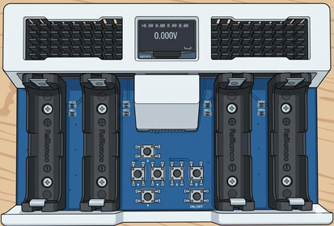
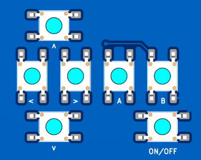
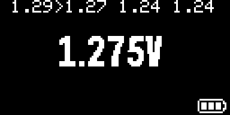
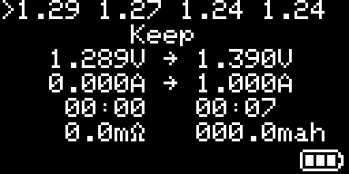
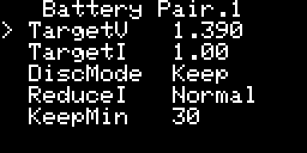
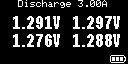
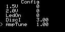

# 単セル制御放電器（単3） 簡単説明書

このプロジェクトは、単3電池を最大4本まで個別に監視しながら放電するための放電器です。  
通常の自動放電モードに加えて、ボタンを押している間だけ放電する簡易モードも搭載しています。

## 主な機能

- 単3電池を最大4本まで個別に放電
- 小数点以下3ケタまで表示＆設定
- 各電池の電圧を個別表示
- 目標電圧までの自動放電
- 電池を取り外しやすい
- 押している間だけ一定電流で放電する手動モード

## 安全上の注意

- 放電中は発熱するため、燃えやすい物の近くで使用しないでください
- 電池の極性を間違えないでください
- 異常発熱、膨らみ、液漏れなどがある電池は使用しないでください

## ボタン配置

- L、R、U、D の十字キー移動
- A、Bボタン
- 起動時＆終了＆モード切替のONボタン

## 基本の使い方

1. 電池をセットして電源を入れます
2. 画面上段に4本分の電圧が表示されます
3. `L/R` ボタンで操作対象の電池を切り替えます
4. 選択中の電池には `>` が表示されます
5. `A` ボタンで選択中電池の放電を開始または停止します

放電中は、選択中の電池について次の情報が表示されます。

- 現在電圧
- 目標電圧
- 現在の放電電流
- 目標放電電流
- 経過時間
- 停止後経過時間
- 内部抵抗の目安
- 積算容量 `mAh`

## ボタン操作

- `L/R`: 対象電池の切り替え
- `A`: 選択中電池の放電 ON/OFF
- `B`: 電池設定画面へ移動
- `U + D` 同時押し: 全体設定画面へ移動
- `ON` 短押し: 押し放電モードへ移動
- `ON` 長押し後に離す: ディープスリープ

## 電池設定

通常画面で `B` ボタンを押すと、電池設定画面に入ります。  
設定はペア単位で保存されます。

- `Battery Pair.1`: スロット1と2
- `Battery Pair.2`: スロット3と4

設定項目は次の通りです。

- `TargetV`: 放電終了の目標電圧 `0.9V - 1.6V`
- `TargetI`: 目標放電電流 `0.4A - 2.0A`
- `DiscMode`: 放電終了後の動作
- `ReduceI`: 目標電圧付近での電流の下げ方
- `KeepMin`: 保持時間 `1 - 180分`

操作方法:

- `L/R`: 値変更
- `U/D`: 項目移動
- `A`: ペア切り替え
- `B`: 保存して通常画面へ戻る

### DiscMode の意味

- `Keep`: 放電後も目標電圧付近を維持する
- `KeepMin`: 放電後、指定した分数だけ維持して終了する
- `Stop`: 目標電圧に達したら終了する

### ReduceI の意味

- `Mild`: ゆるやかに電流を下げる
- `Normal`: 標準
- `Hard`: 早めに電流を下げる
- `None`: 電流を下げない

## 押し放電モード

通常画面で `ON` ボタンを短押しすると、押し放電モードに入ります。  
画面上部に `Discharge x.xA` と表示され、その電流でボタンを押している間だけ放電します。

現在のコードでは `V2_PCB` 設定が有効で、ボタン割り当ては次の通りです。

- `L`: スロット1
- `R`: スロット2
- `A`: スロット3
- `B`: スロット4

`ON` ボタンをもう一度短押しすると通常画面へ戻ります。

## 全体設定

通常画面または押し放電モード画面で `U + D` を同時押しすると、全体設定画面に入ります。

設定項目は次の通りです。

- `0.0V - 2.0V`: 電圧校正値
- `LedOn`: LED 点滅の有効/無効
- `DiscI`: 押し放電モードの放電電流 `0.4A - 3.0A`
- `AmpTune`: 電流補正係数 `0.8 - 1.2`
- `Decimal`: 表示小数桁 `2` または `3`

操作方法:

- `L/R`: 値変更
- `U/D`: 項目移動
- `B`: 保存して元の画面へ戻る

## 設定の初期化

電源投入時に `A` ボタンを押したままにすると、保存済み設定を初期値で上書きして起動します。

## おまけ機能

起動時にボタンを押しながら電源を入れると、放電器以外のモードが起動します。

- `D` を押しながら起動: Flappy Game
- `U` を押しながら起動: Stopwatch

通常の放電器として使う場合は、何も押さずに起動してください。
